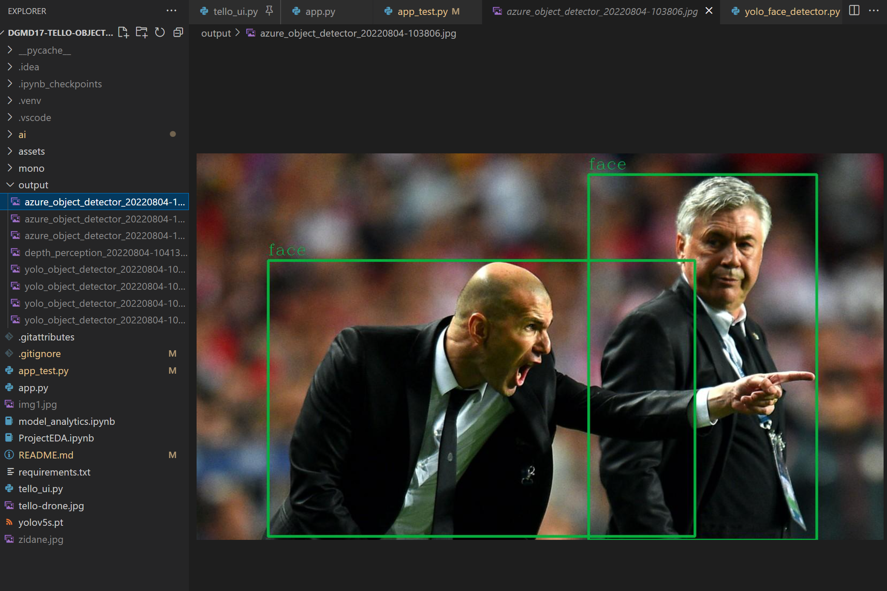

# dgmd17-tello-objectdetection
Final project by Ryan, Muthu, and Eumar. Object Detection with Yolo, Azure, and Tello Drone

## Step to run the project locally:

The app will be launched even if a drone is not connected to the WIFI.

 1. Clone the repo locally

 2. Create a [Python Enviroment](https://www.tutorialspoint.com/how-to-create-a-virtual-environment-in-python)
    ```
    python -m venv .venv & ./venv/Scripts/activate)
    ```
 3. Install the dependencies using pip
    ```
    pip install -r requirements.txt
    ```
 4. With Tello Drone
    - Connect the Tello Drone to the computer via wifi
    - Run python app.py
        ```
        python app.py
        ```
    - Once the app starts click `connect` button in the app to connect the app with Drone
    - Click `Start Streaming` to start the video feeds
    - Select the model from the drop down to the one you would like to use
    - Click `Take Off` button to lift the drone and drone should move based on the out put from the model
5. Without drone, use our app_test script to run the models with sample images
   - Run python app_test.py
        ```
        python app_test.py
        ```
   - We have inluded sample image for the models, you can change the images with people in here
   - The models output will be saved to output dir
   - Model Output images are stored in `test_output` folder
<p align="center">
  
</p>

6. Checkout the APP demo in YouTube, to learn how to use the models,view models outputs and navigate the drone
<p align="center">
  <a href="https://www.youtube.com/watch?v=LKzUzrd4MzM" target="_blank">
        
  </a>
</p>
<!-- [](https://www.youtube.com/watch?v=LKzUzrd4MzM) -->


## Project Structure


File | Description
------ | ------
[assets folder](./assets/)   | Contains custom weights for YOLO face detection and holds model [ai folder](./ai)   | Contains class for each model
[EDA folder](./EDA/)   | Python Notebooks for Exploratory Data Analysis
[app.py](./app.py) | Entry point for the application. Instatiates UI and model classes to start the application
[tello_ui.py](./tello_ui.py) | Tello Control User Interface (UI) Class. Create the UI using tkinter
[object_detector.py](./ai/object_detector.py)   | Base class for object detector
[azure_object_detector.py](./ai/azure_object_detector.py)   | Azure object detector class using azure-cognitiveservices-vision-computervision library
[yolo_face_detector.py](./ai/yolo_face_detector.py)   | YOLO face detector class using custom weights
[yolo_object_detector.py](./ai/yolo_object_detector.py)   | YOLO object detector class using the ultralytics/yolov5 library
[depth_perception.py](./ai/depth_perception.py)   | Depth Perception class using manydepth library
telemetry data
[ProjectEDA.ipynb](./Eda/ProjectEDA.ipynb)   | Python Notebook for Exploratory Data Analysis by Eumar and Muthu
[requirements.txt](./requirements.txt) | Contains list of required python libraries
